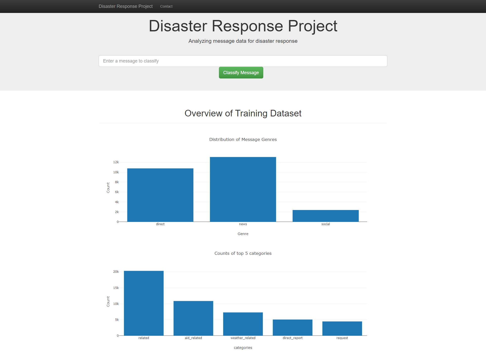
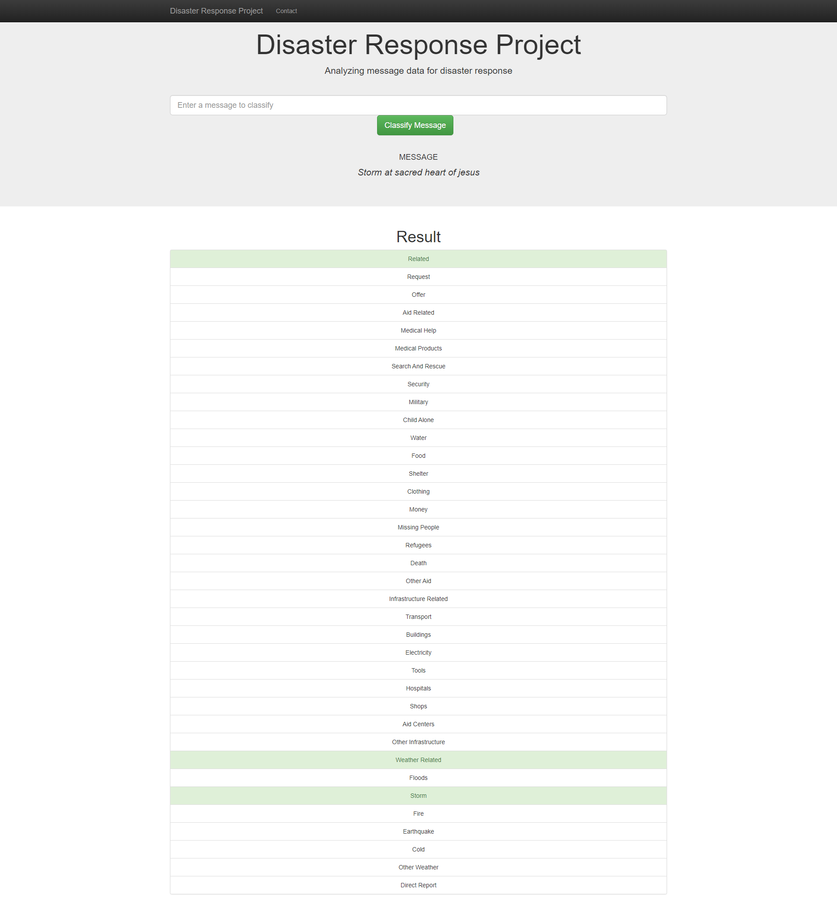

# Disaster Response Pipeline Project

This web app project helps in categorization of real messages which can be sent to an appropriate diaster relief agency.

### Screenshots

### Files

- data/
    - disaster_categories.csv : data set
    - disaster_messages.csv : data set
    - process_data.py: Takes in two datasets from database, cleans data and store it in      SQLite  database

- models/
    - train_classifier.py : Takes in database file, creates and trains a classifier, and stores the classifier into a pickle file

- app/
    - run.py : Contains flask web app scripts and visualization using plotly
    - templates : contains HTML templates

### Instructions:
1. Run the following commands in the project's root directory to set up your database and model.

    - To run ETL pipeline that cleans data and stores in database
        `python data/process_data.py data/disaster_messages.csv data/disaster_categories.csv data/DisasterResponse.db`
    - To run ML pipeline that trains classifier and saves
        `python models/train_classifier.py data/DisasterResponse.db models/classifier.pkl`

2. Run the following command in the app's directory to run your web app.
    `python run.py`

3. Go to http://0.0.0.0:3001/

### Acknowledgement

I would thank FigureEight and Udacity for guidance